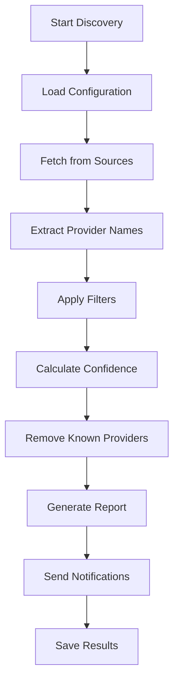

# 🤖 AI Provider Discovery System

## Overview

The AI Provider Discovery System automatically searches for new AI providers from multiple sources and notifies you when new ones are found. This helps keep the AI Status Dashboard up-to-date with the latest AI services.

## Features

- **🔍 Multi-Source Discovery**: Searches GitHub, Product Hunt, Reddit, and specialized AI platforms
- **⚙️ Configurable Sources**: Easy to add/remove discovery sources via JSON configuration
- **🎯 Smart Filtering**: Confidence scoring and duplicate detection
- **📧 Multiple Notifications**: GitHub issues, email, and Slack notifications
- **📊 Historical Tracking**: Maintains discovery history for trend analysis
- **🕐 Automated Scheduling**: Runs daily via GitHub Actions

## How It Works

### 1. Data Sources

The system searches multiple sources for AI provider mentions:

| Source | Type | Confidence | Description |
|--------|------|------------|-------------|
| **Artificial Analysis** | HTML | 80% | Comprehensive AI model analysis platform |
| **Hugging Face Models** | HTML | 90% | Leading ML model repository |
| **GitHub Awesome Lists** | API | 70% | Community-curated awesome lists |
| **Product Hunt AI** | HTML | 60% | Latest AI product launches |
| **AI News Reddit** | JSON | 50% | AI community discussions |
| **Papers With Code** | HTML | 70% | State-of-the-art ML models |

### 2. Discovery Process



### 3. Pattern Matching

Each source uses regex patterns to extract provider names:

```javascript
// Example patterns
"(?:api\\.)?([a-z0-9-]+)\\.(?:ai|com|org)(?:\\/api)?"  // Domain-based
"([a-z0-9-]+)\\s+(?:ai|llm|language model|api)"       // Context-based
"\\*\\s*\\[([a-z0-9-]+)\\]"                           // Markdown links
```

## Configuration

### Main Configuration File

Edit `config/discovery-sources.json` to customize the discovery system:

```json
{
  "sources": [
    {
      "name": "Source Name",
      "url": "https://example.com/api",
      "type": "html|github|reddit|api",
      "enabled": true,
      "patterns": ["regex1", "regex2"],
      "confidence": 0.8,
      "description": "Source description"
    }
  ],
  "knownProviders": ["openai", "anthropic", ...],
  "filters": {
    "minLength": 3,
    "maxLength": 20,
    "excludeWords": ["api", "www", ...],
    "requiredConfidence": 0.5
  }
}
```

### Environment Variables

Set these in GitHub repository secrets:

```bash
NOTIFICATION_EMAIL=your-email@domain.com  # Required for email notifications
SLACK_WEBHOOK_URL=https://hooks.slack.com/...  # Optional for Slack
GITHUB_TOKEN=ghp_...  # Auto-provided by GitHub Actions
```

## Usage

### Automatic Daily Runs

The system runs automatically every day at 9:00 AM UTC via GitHub Actions. View runs at:
```
https://github.com/khalidsaidi/aistatusdashboard/actions/workflows/ai-provider-discovery.yml
```

### Manual Execution

#### Via GitHub Actions UI
1. Go to Actions → AI Provider Discovery
2. Click "Run workflow"
3. Optionally override email or enable dry run mode

#### Local Development
```bash
# Install dependencies
npm install

# Run discovery script
node scripts/discover-ai-providers.js

# View results
cat logs/discovery-results.json
```

### Dry Run Mode

Test the system without sending notifications:

```bash
# GitHub Actions
# Set dry_run: true in workflow dispatch

# Local
DRY_RUN=true node scripts/discover-ai-providers.js
```

## Notifications

### GitHub Issues

When new providers are found, the system creates GitHub issues with:

- **Title**: "🤖 AI Provider Discovery Report - X new providers found"
- **Labels**: `ai-discovery`, `automated`, `new-provider`
- **Content**: Detailed report with provider information and next steps

### Email Format

```markdown
# AI Provider Discovery Report

**Date:** January 15, 2025

## 🆕 New Providers Discovered (3)

### 1. together-ai
- **Source:** GitHub: awesome-ai-tools/awesome-list
- **Description:** Found in awesome list
- **Confidence:** 70%
- **URL:** https://github.com/awesome-ai-tools/awesome-list

### 2. fireworks-ai
- **Source:** Product Hunt AI
- **Description:** Latest AI product launches
- **Confidence:** 60%
- **URL:** https://www.producthunt.com/topics/artificial-intelligence

## 🔧 Next Steps

1. Review each provider for legitimacy
2. Check if they have public status pages
3. Add valid providers to the dashboard configuration
4. Update the known providers list
```

## Adding New Providers

When the system discovers legitimate new providers:

### 1. Verify the Provider

- ✅ Has a public API or service
- ✅ Provides AI/ML capabilities
- ✅ Has a status page or monitoring endpoint
- ✅ Is actively maintained

### 2. Add to Dashboard

1. **Update Configuration**:
   ```javascript
   // lib/providers.ts
   export const AI_PROVIDERS = [
     // ... existing providers
     {
       id: 'new-provider',
       name: 'New Provider',
       url: 'https://status.newprovider.com',
       // ... other config
     }
   ];
   ```

2. **Add to Known List**:
   ```json
   // config/discovery-sources.json
   "knownProviders": [
     "openai", "anthropic", ..., "new-provider"
   ]
   ```

3. **Test Integration**:
   ```bash
   npm run dev
   # Verify provider appears and status works
   ```

## Troubleshooting

### Common Issues

#### No New Providers Found
- Check if sources are responding (view workflow logs)
- Verify confidence threshold isn't too high
- Ensure known providers list is up-to-date

#### False Positives
- Add problematic terms to `excludeWords` filter
- Increase confidence threshold
- Refine regex patterns for specific sources

#### Discovery Failures
- Check source URL accessibility
- Verify API rate limits aren't exceeded
- Review regex patterns for accuracy

### Debugging

#### View Detailed Logs
```bash
# GitHub Actions logs
https://github.com/khalidsaidi/aistatusdashboard/actions

# Local logs
tail -f logs/discovery-results.json
```

#### Test Individual Sources
```javascript
// Test specific source
const discovery = new AIProviderDiscovery();
const source = CONFIG.sources.find(s => s.name === 'GitHub AI Awesome Lists');
const results = await discovery.fetchFromSource(source);
console.log(results);
```

## Maintenance

### Regular Tasks

1. **Review Discovery Results** (Weekly)
   - Check GitHub issues for new providers
   - Validate discovered providers
   - Update known providers list

2. **Update Sources** (Monthly)
   - Add new discovery sources
   - Remove inactive sources
   - Refine regex patterns

3. **Monitor Performance** (Monthly)
   - Check success rates by source
   - Review confidence scoring accuracy
   - Optimize discovery patterns

### Configuration Updates

```bash
# Update sources
vim config/discovery-sources.json

# Test configuration
node scripts/discover-ai-providers.js

# Commit changes
git add config/discovery-sources.json
git commit -m "Update discovery sources configuration"
git push
```

## API Reference

### AIProviderDiscovery Class

```javascript
const discovery = new AIProviderDiscovery();

// Main methods
await discovery.run()                          // Full discovery process
await discovery.discoverFromAllSources()      // Fetch from all sources
await discovery.analyzeResults()              // Filter and analyze
await discovery.sendNotifications()           // Send notifications

// Utility methods
discovery.normalizeProviderName(name)         // Clean provider name
discovery.isValidProvider(name)               // Validate provider name
discovery.deduplicateProviders(providers)     // Remove duplicates
```

### Configuration Schema

```typescript
interface DiscoveryConfig {
  sources: Source[];
  knownProviders: string[];
  filters: FilterConfig;
  notification: NotificationConfig;
  schedule: ScheduleConfig;
  storage: StorageConfig;
}

interface Source {
  name: string;
  url: string;
  type: 'html' | 'github' | 'reddit' | 'api';
  enabled: boolean;
  patterns: string[];
  confidence: number;
  description: string;
}
```

## Contributing

### Adding New Sources

1. **Identify Source**: Find reliable AI-related data sources
2. **Test Patterns**: Develop regex patterns for provider extraction
3. **Configure Source**: Add to `discovery-sources.json`
4. **Test Discovery**: Run script and verify results
5. **Submit PR**: Include documentation and test results

### Improving Patterns

1. **Analyze False Positives**: Review discovery results
2. **Refine Regex**: Update patterns for better accuracy
3. **Test Changes**: Verify improvements with dry runs
4. **Update Documentation**: Document pattern changes

## Security Considerations

- **Rate Limiting**: Respects source rate limits
- **Error Handling**: Graceful failure handling
- **Data Privacy**: No sensitive data stored
- **Access Control**: Uses minimal GitHub permissions

## Future Enhancements

- **Machine Learning**: AI-powered provider classification
- **Real-time Discovery**: WebSocket-based monitoring
- **Advanced Analytics**: Trend analysis and predictions
- **Integration APIs**: Webhook endpoints for external systems