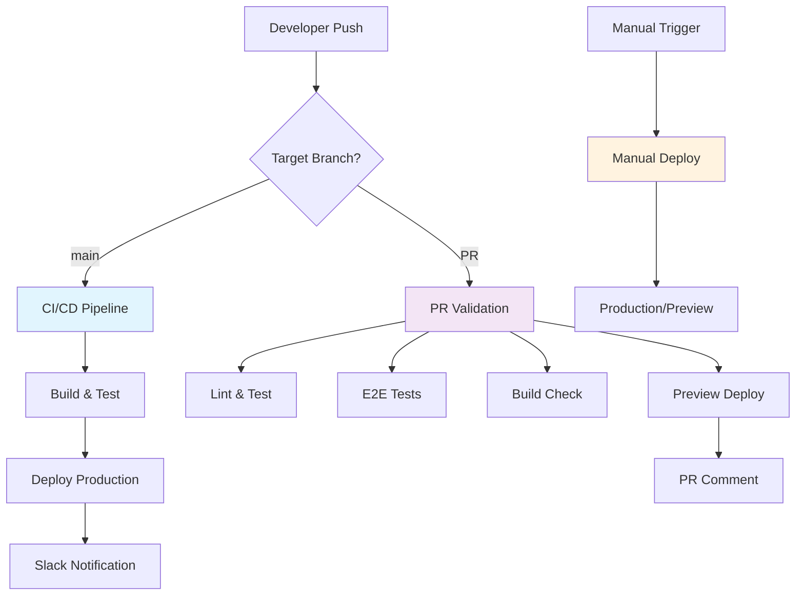

# GitHub Workflow Documentation

## 🔄 **Workflow Overview**

This repository uses a **single-branch strategy** with comprehensive CI/CD automation to ensure code quality and seamless deployments.

### **Branch Strategy**
- **Primary Branch:** `main` 
- **Development Model:** Direct commits with Pull Request validation
- **Deployment:** Automatic from `main` branch
- **No feature branches required** for solo development

---

## 📋 **Workflow Architecture**



---

## 🚀 **Three Core Workflows**

### **1. CI/CD Pipeline** (`ci-cd.yml`)

**Triggers:**
```yaml
on:
  push:
    branches: [main]
  workflow_dispatch:
```

**Jobs:**

#### **Build and Test Job**
```bash
✅ Checkout code
✅ Setup Node.js 20.x with npm cache
✅ Install dependencies (npm ci)
✅ Run linting (npm run lint)
✅ Run unit tests with coverage (npm run test:coverage)
✅ Install Playwright browsers
✅ Run E2E tests (npm run test:e2e)
✅ Build application (npm run build)
✅ Upload coverage to Codecov
✅ Upload build artifacts
```

#### **Deploy Job** (runs after build-and-test passes)
```bash
✅ Download build artifacts
✅ Deploy to production hosting
✅ Send Slack notifications
```

**Usage:**
- **Automatic:** Triggers on every push to `main`
- **Manual:** Use "Run workflow" button in GitHub Actions

---

### **2. Pull Request Checks** (`pr.yml`)

**Triggers:**
```yaml
on:
  pull_request:
    types: [opened, synchronize, reopened]
```

**Four Parallel Jobs:**

#### **Job 1: Lint and Test**
```bash
✅ ESLint validation
✅ TypeScript check (npx tsc --noEmit)
✅ Workflow validation (npm run validate:workflows)
✅ Unit tests with coverage
✅ Upload coverage to Codecov
```

#### **Job 2: E2E Tests**
```bash
✅ Install Playwright browsers
✅ Run E2E tests (npm run test:e2e)
✅ Upload test results as artifacts
```

#### **Job 3: Build Check**
```bash
✅ Build application
✅ Verify .next directory exists
```

#### **Job 4: Preview Deploy**
```bash
✅ Deploy preview environment
✅ Comment PR with preview URL
```

**Example PR Comment:**
```
🚀 Preview deployed to: https://preview-pr-123.aistatusdashboard.com
```

---

### **3. Manual Deployment** (`manual-deploy.yml`)

**Triggers:**
```yaml
on:
  workflow_dispatch:
    inputs:
      environment: [production, preview]
      skip-tests: boolean
      reason: string (required)
```

**Process:**

#### **Step 1: Validation**
```bash
✅ Log deployment request
✅ Create GitHub issue for tracking
✅ Validate deployment parameters
```

#### **Step 2: Deploy**
```bash
✅ Run tests (optional, based on skip-tests input)
✅ Build application
✅ Deploy to chosen environment
✅ Run health checks
```

#### **Step 3: Notification**
```bash
✅ Update GitHub issue with status
✅ Close issue on success
```

**Usage:**
1. Go to Actions → Manual Deployment
2. Click "Run workflow"
3. Select environment (production/preview)
4. Optionally skip tests
5. Provide deployment reason

---

## 🛡️ **Quality Gates & Automation**

### **Dependabot Configuration**

**Schedule:** Weekly updates every Monday at 3:00 AM

**Package Groups:**
```yaml
react:          # React ecosystem
  - react, react-dom, @types/react*
nextjs:         # Next.js ecosystem  
  - next, eslint-config-next
testing:        # Testing frameworks
  - jest*, @testing-library/*, playwright
linting:        # Code quality
  - eslint*, prettier*, @typescript-eslint/*
```

**Safeguards:**
- ✅ Auto-assignment to @khalidsaidi
- ✅ Ignores major version updates for Next.js/TypeScript
- ✅ Maximum 10 open PRs for npm, 5 for GitHub Actions

### **Code Ownership** (CODEOWNERS)

```bash
# Global ownership
* @khalidsaidi

# Specific areas
/src/                    @khalidsaidi  # Frontend code
/server/                 @khalidsaidi  # Backend code
/.github/workflows/      @khalidsaidi  # CI/CD
/*.md                    @khalidsaidi  # Documentation
*.test.ts               @khalidsaidi  # Tests
/.env*                  @khalidsaidi  # Security-sensitive
```

### **Workflow Validation** (`validate-workflows.js`)

**Checks:**
- ✅ npm scripts exist in package.json
- ✅ File references are valid
- ✅ GitHub Actions inputs match schemas
- ✅ No broken workflow configurations

**Runs on:**
- Pre-commit hooks
- Pull request validation
- Manual workflow dispatch

---

## 📖 **Development Process**

### **For Solo Development (Direct to Main)**

```bash
# 1. Make changes locally
git add .
git commit -m "feat: add new feature"

# 2. Push to main (triggers CI/CD)
git push origin main

# 3. Monitor GitHub Actions
# ✅ Build & Test passes
# ✅ Deploy to production
# ✅ Slack notification sent
```

### **For Collaborative Development (Pull Requests)**

```bash
# 1. Create feature branch (optional)
git checkout -b feature/new-feature

# 2. Make changes and commit
git add .
git commit -m "feat: add new feature"

# 3. Push and create PR
git push origin feature/new-feature
# Create PR on GitHub

# 4. PR triggers validation
# ✅ Lint & Test
# ✅ E2E Tests  
# ✅ Build Check
# ✅ Preview Deploy

# 5. Review and merge
# ✅ All checks pass
# ✅ Code review approved
# ✅ Merge to main
# ✅ Automatic production deployment
```

### **For Emergency Deployments**

```bash
# 1. Use Manual Deployment workflow
# 2. Select "production" environment
# 3. Check "skip-tests" if urgent
# 4. Provide reason: "Critical security fix"
# 5. Monitor deployment in GitHub issue
```

---

## 🔧 **Configuration Files**

### **Workflow Files**
```
.github/
├── workflows/
│   ├── ci-cd.yml           # Main CI/CD pipeline
│   ├── pr.yml              # Pull request validation  
│   └── manual-deploy.yml   # Manual deployments
├── dependabot.yml          # Dependency updates
└── CODEOWNERS             # Code ownership rules
```

### **Scripts**
```
scripts/
├── validate-workflows.js   # Workflow validation
└── fetch-ai-logos.sh      # Logo fetching for builds
```

### **Package.json Scripts**
```json
{
  "scripts": {
    "prebuild": "./scripts/fetch-ai-logos.sh",
    "build": "next build",
    "test:coverage": "jest --coverage",
    "test:e2e": "playwright test",
    "validate:workflows": "node scripts/validate-workflows.js"
  }
}
```

---

## 📊 **Monitoring & Metrics**

### **GitHub Actions Dashboard**
- **Build Success Rate:** Target 95%+
- **Test Coverage:** Tracked via Codecov
- **Deployment Frequency:** Automatic on main pushes
- **Mean Time to Recovery:** < 10 minutes

### **Notifications**
- **Slack Integration:** Deployment status updates
- **GitHub Issues:** Manual deployment tracking
- **PR Comments:** Preview deployment URLs
- **Email:** Dependabot security alerts

### **Artifacts & Reports**
- **Coverage Reports:** Uploaded to Codecov
- **E2E Test Results:** 7-day retention
- **Build Artifacts:** 1-day retention
- **Playwright Reports:** Available for failed tests

---

## 🚨 **Troubleshooting**

### **Common Issues**

#### **Build Failures**
```bash
# Check logs in GitHub Actions
# Common causes:
- Logo fetching script fails (network issues)
- TypeScript errors
- Test failures
- Linting violations

# Solutions:
- Re-run failed jobs
- Check script permissions (chmod +x)
- Verify all dependencies in package.json
```

#### **Deployment Failures**
```bash
# Check deployment logs
# Common causes:
- Missing environment variables
- Build artifacts not found
- Hosting service issues

# Solutions:
- Verify secrets in GitHub repository settings
- Check hosting service status
- Use manual deployment with skip-tests
```

#### **PR Check Failures**
```bash
# Check individual job logs
# Common causes:
- Merge conflicts
- Failing tests
- Linting errors

# Solutions:
- Resolve merge conflicts
- Fix failing tests locally
- Run npm run lint locally
```

### **Emergency Procedures**

#### **Hotfix Process**
1. **Create hotfix branch** from main
2. **Make minimal changes** to fix issue
3. **Use manual deployment** with skip-tests
4. **Create PR** for code review (after deployment)
5. **Monitor** application health

#### **Rollback Process**
1. **Identify last known good commit**
2. **Use manual deployment** to deploy previous version
3. **Create issue** to track rollback reason
4. **Fix forward** rather than maintaining rollback

---

## 📈 **Future Enhancements**

### **Planned Improvements**
- [ ] **Multi-environment support** (staging, production)
- [ ] **Blue-green deployments** for zero downtime
- [ ] **Performance testing** in CI pipeline
- [ ] **Security scanning** with CodeQL
- [ ] **Automated changelog** generation

### **Branch Strategy Evolution**
- **Current:** Single branch (main)
- **Future:** GitFlow with develop/release branches
- **Enterprise:** Environment-specific branches

---

**Last Updated:** January 2025  
**Repository:** https://github.com/khalidsaidi/aistatusdashboard  
**Maintainer:** Khalid Saidi (Kalimero) 